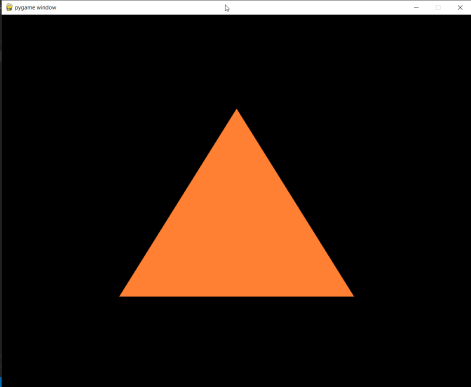

# HelloWorldOpenGl

Para este ejercicio, deben preparar un archivo capaz de renderizar un triangulo en la pantalla utilizando opengl.

El objetivo de este ejercicio es que preparen sus sistemas para el último proyecto del curso, y que les sirva como un pequeño boilerplate.

 

Les recomiendo utilizar pygame y glm si estan en python.

 
